<div align="center">

# ⚙️ Snappy Switcher Configuration

*Customize every aspect of your window switcher*

</div>

---

## 📍 Configuration Location

```
~/.config/snappy-switcher/config.ini
```

> 💡 **Quick Setup:** Run `snappy-install-config` to create the config file and install themes automatically.

---

## 🚀 Quick Start

```ini
[general]
mode = context

[theme]
name = catppuccin-mocha.ini

[icons]
theme = Papirus-Dark
fallback = hicolor
```

---

## 📋 Configuration Sections


---

## 🎯 [general] — Mode Settings

Control how windows are displayed and grouped.

```mermaid
flowchart LR
    subgraph Overview["mode = overview"]
        O1["Window 1"]
        O2["Window 2"]
        O3["Window 3"]
        O4["Window 4"]
        O5["Window 5"]
    end
    
    subgraph Context["mode = context"]
        C1["App × 3"]
        C2["Browser"]
        C3["Terminal"]
    end
    
    style O1 fill:#303446,stroke:#f5c2e7,color:#f5c2e7,stroke-width:2px
    style O2 fill:#303446,stroke:#f5c2e7,color:#f5c2e7,stroke-width:2px
    style O3 fill:#303446,stroke:#f5c2e7,color:#f5c2e7,stroke-width:2px
    style O4 fill:#303446,stroke:#f5c2e7,color:#f5c2e7,stroke-width:2px
    style O5 fill:#303446,stroke:#f5c2e7,color:#f5c2e7,stroke-width:2px
    
    style C1 fill:#303446,stroke:#cba6f7,color:#cba6f7,stroke-width:2px
    style C2 fill:#303446,stroke:#a6e3a1,color:#a6e3a1,stroke-width:2px
    style C3 fill:#303446,stroke:#89dceb,color:#89dceb,stroke-width:2px
```



| Key | Values | Default | Description |
|-----|--------|---------|-------------|
| `mode` | `overview`, `context` | `context` | Window grouping mode |

### Mode Comparison

| Mode | Behavior | Best For |
|------|----------|----------|
| **Overview** | Shows all windows individually | Simple workflows, few windows |
| **Context** | Groups tiled windows by workspace + app class | Power users, many windows |

```ini
[general]
mode = context  # Enable intelligent grouping
```

---

## 🎨 [theme] — Colors & Styling

All colors use hex format: `#RRGGBB`


### Color Options

| Key | Default | Description |
|-----|---------|-------------|
| `name` | `snappy-slate.ini` | Theme file to load |
| `background` | `#11111b` | Main overlay background |
| `card_bg` | `#1e1e2e` | Card background color |
| `card_selected` | `#2a2a3c` | Selected card background |
| `border_color` | `#ca9ee6` | Selection border (accent) |
| `text_color` | `#cdd6f4` | Primary text color |
| `subtext_color` | `#6c7086` | Secondary/dimmed text |

### Border & Corner Options

| Key | Default | Description |
|-----|---------|-------------|
| `border_width` | `2` | Border thickness (px) |
| `corner_radius` | `12` | Rounded corner radius (px) |

```ini
[theme]
name = catppuccin-mocha.ini

# Override specific colors (optional)
background = #11111b
card_bg = #1e1e2e
card_selected = #2a2a3c
border_color = #ca9ee6
text_color = #cdd6f4
subtext_color = #6c7086
border_width = 2
corner_radius = 12
```

### 🎭 Available Themes

<table>
<tr>
<td align="center">🌙</td>
<td><code>snappy-slate.ini</code></td>
<td>Default dark theme</td>
</tr>
<tr>
<td align="center">🍫</td>
<td><code>catppuccin-mocha.ini</code></td>
<td>Catppuccin Mocha</td>
</tr>
<tr>
<td align="center">☕</td>
<td><code>catppuccin-latte.ini</code></td>
<td>Catppuccin Latte (light)</td>
</tr>
<tr>
<td align="center">🌌</td>
<td><code>tokyo-night.ini</code></td>
<td>Tokyo Night</td>
</tr>
<tr>
<td align="center">❄️</td>
<td><code>nord.ini</code></td>
<td>Nord</td>
</tr>
<tr>
<td align="center">🧛</td>
<td><code>dracula.ini</code></td>
<td>Dracula</td>
</tr>
<tr>
<td align="center">🪵</td>
<td><code>gruvbox-dark.ini</code></td>
<td>Gruvbox Dark</td>
</tr>
<tr>
<td align="center">🌹</td>
<td><code>rose-pine.ini</code></td>
<td>Rosé Pine</td>
</tr>
<tr>
<td align="center">🌲</td>
<td><code>nordic.ini</code></td>
<td>Nordic variant</td>
</tr>
<tr>
<td align="center">🌿</td>
<td><code>grovestorm.ini</code></td>
<td>Grovestorm</td>
</tr>
<tr>
<td align="center">🤖</td>
<td><code>cyberpunk.ini</code></td>
<td>Cyberpunk</td>
</tr>
</table>

---

## 📐 [layout] — Dimensions & Spacing

```mermaid
graph TB
    subgraph Grid["Layout Visualization"]
        subgraph Row1["Row 1"]
            C1["Card"]
            C2["Card"]
            C3["Card"]
        end
        subgraph Row2["Row 2"]
            C4["Card"]
            C5["Card"]
        end
    end
    
    P["← padding →"]
    G["← card_gap →"]
    
    style C1 fill:#313244,stroke:#89b4fa,color:#cdd6f4
    style C2 fill:#313244,stroke:#89b4fa,color:#cdd6f4
    style C3 fill:#313244,stroke:#89b4fa,color:#cdd6f4
    style C4 fill:#313244,stroke:#89b4fa,color:#cdd6f4
    style C5 fill:#2a2a3c,stroke:#cba6f7,color:#cdd6f4
```



### Card Dimensions

| Key | Default | Description |
|-----|---------|-------------|
| `card_width` | `160` | Card width in pixels |
| `card_height` | `140` | Card height in pixels |

### Spacing

| Key | Default | Description |
|-----|---------|-------------|
| `card_gap` | `8` | Gap between cards (px) |
| `padding` | `16` | Window padding (px) |

### Grid & Icons

| Key | Default | Description |
|-----|---------|-------------|
| `max_cols` | `5` | Maximum columns before wrap |
| `icon_size` | `56` | App icon size (px) |
| `icon_radius` | `14` | Icon corner radius (px) |

```ini
[layout]
card_width = 160
card_height = 140
card_gap = 8
padding = 16
max_cols = 5
icon_size = 56
icon_radius = 14
```

---

## 🖼️ [icons] — Icon Theme

```mermaid
flowchart LR
    APP["App Class"]
    APP --> T1["🎨 Primary Theme"]
    T1 -->|not found| T2["🔄 Fallback Theme"]
    T2 -->|not found| T3["🔤 Letter Icon"]
    
    T1 -->|found| ICON["✅ Display Icon"]
    T2 -->|found| ICON
    T3 --> ICON

    style T1 fill:#89b4fa,stroke:#1e1e2e,color:#1e1e2e
    style T2 fill:#a6e3a1,stroke:#1e1e2e,color:#1e1e2e
    style T3 fill:#f9e2af,stroke:#1e1e2e,color:#1e1e2e
```



| Key | Default | Description |
|-----|---------|-------------|
| `theme` | `Tela-dracula` | Primary icon theme |
| `fallback` | `Tela-circle-dracula` | Fallback theme |
| `show_letter_fallback` | `true` | Show letter if no icon found |

### Popular Icon Themes

| Theme | Style |
|-------|-------|
| `Papirus` | Flat, colorful |
| `Papirus-Dark` | Flat, dark variant |
| `Tela` | Modern, gradient |
| `Numix` | Flat, circle |
| `Adwaita` | GNOME default |
| `hicolor` | System fallback |

```ini
[icons]
theme = Papirus-Dark
fallback = hicolor
show_letter_fallback = true
```

---

## ✏️ [font] — Typography

| Key | Default | Description |
|-----|---------|-------------|
| `family` | `Sans` | Font family name |
| `weight` | `Bold` | Font weight |
| `title_size` | `10` | Title font size (px) |
| `icon_letter_size` | `24` | Fallback letter size (px) |

### Recommended Fonts

| Font | Style |
|------|-------|
| `Sans` | System default |
| `Inter` | Clean, modern |
| `Roboto` | Material Design |
| `JetBrainsMono Nerd Font` | Monospace + icons |
| `SF Pro Display` | macOS-like |

```ini
[font]
family = Inter
weight = Bold
title_size = 10
icon_letter_size = 24
```

---

## 📄 Complete Example

<details>
<summary>📋 <b>Click to expand full config.ini</b></summary>

```ini
# ~/.config/snappy-switcher/config.ini
# ═══════════════════════════════════════════════════════════════════

[general]
mode = context

[theme]
name = catppuccin-mocha.ini
background = #11111b
card_bg = #1e1e2e
card_selected = #2a2a3c
border_color = #ca9ee6
text_color = #cdd6f4
subtext_color = #6c7086
border_width = 2
corner_radius = 12

[layout]
card_width = 160
card_height = 140
card_gap = 8
padding = 16
max_cols = 5
icon_size = 56
icon_radius = 14

[icons]
theme = Papirus-Dark
fallback = hicolor
show_letter_fallback = true

[font]
family = Inter
weight = Bold
title_size = 10
icon_letter_size = 24
```

</details>

---

## ⌨️ Hyprland Keybindings

Add these to `~/.config/hypr/hyprland.conf`:

```bash
# Start daemon on login
exec-once = snappy-switcher --daemon

# Alt-Tab to cycle windows
bind = ALT, Tab, exec, snappy-switcher next
bind = ALT SHIFT, Tab, exec, snappy-switcher prev
```

### Optional Keybindings

```bash
# Toggle visibility
bind = SUPER, Tab, exec, snappy-switcher toggle

# Quick hide
bind = , Escape, exec, snappy-switcher hide
```

---

<div align="center">

**[← Back to README](../README.md)** · **[Architecture Guide →](ARCHITECTURE.md)**

</div>
